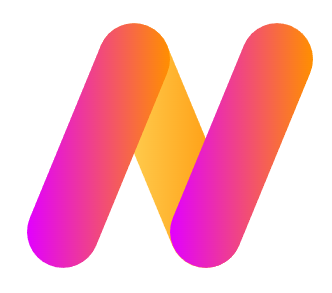

# Welcome to NexusPHP Framework

## Overview

Welcome to the NexusPHP framework - a powerful and flexible PHP framework designed to streamline web development and empower developers to build efficient and scalable applications. Whether you are a seasoned developer or just starting, NexusPHP provides you with the tools and architecture to create robust web applications with ease.

### Key Features

- **Lightweight and Fast:** NexusPHP is designed to be lightweight and fast, ensuring optimal performance for your web applications.
- **MVC Architecture:** The framework follows the Model-View-Controller (MVC) pattern, promoting a clear separation of concerns and making code organization a breeze.
- **Flexible Routing:** Define custom routes easily to handle various URL patterns and RESTful APIs.
- **Database Abstraction:** NexusPHP provides a database abstraction layer, allowing you to work with multiple database systems seamlessly.
- **Template Engine:** A powerful template engine simplifies the creation of dynamic views and enhances code reusability.
- **Authentication and Authorization:** Implement secure user authentication and fine-grained access control effortlessly.
- **Caching:** Boost performance by caching data and views, reducing database queries and server load.
- **Error Handling:** A comprehensive error handling mechanism helps you identify and fix issues efficiently.
- **Community-driven:** NexusPHP is backed by an active and friendly community, providing support, tutorials, and extensions to enhance your development experience.

### Documentation
For in-depth information and detailed explanations, check out the NexusPHP Documentation. The documentation covers everything you need to know about using the framework efficiently, from installation to advanced topics.

### Community and Support
Join the NexusPHP community to interact with other developers, seek help, share your experiences, and contribute to the framework's development. Here are some community resources:

**GitHub:** Contribute to the project, report bugs, and submit feature requests.

**Discord:** Get instant support and chat to like minded developers.

**Documentation:** Access comprehensive guides and references for the framework.

### License
NexusPHP is an open-source framework released under the MIT License.

We hope you find NexusPHP enjoyable and productive for your web development needs. Happy coding!
